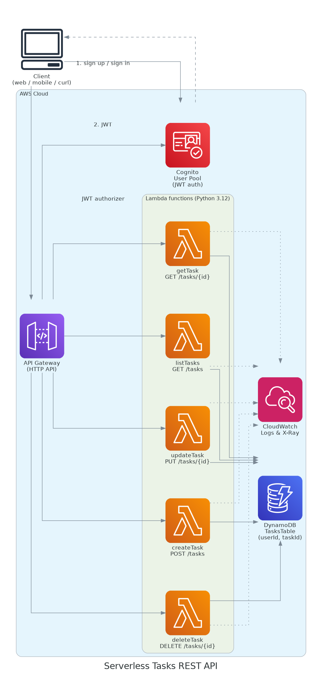

# Serverless Tasks REST API — AWS SAA-C03 Graduation Project

A fully serverless CRUD REST API for managing per-user "tasks" (a to-do list),
built as the graduation project for the **AWS Certified Solutions Architect –
Associate** track (Manara).

Authenticated users can create, list, view, update and delete their own tasks
through an HTTPS API. There are no servers to patch or scale — every
component is managed and pay-per-use.

## Architecture



| Component | AWS Service | Purpose |
|---|---|---|
| Auth | **Amazon Cognito** (User Pool) | Sign-up / sign-in, issues JWTs |
| API | **API Gateway (HTTP API)** | Public HTTPS endpoint, validates JWT via built-in authorizer |
| Compute | **AWS Lambda** (Python 3.12), one function per operation | Business logic, least-privilege IAM per function |
| Data | **Amazon DynamoDB** (`userId` + `taskId` composite key, on-demand) | Durable storage, data isolated per user |
| Observability | **CloudWatch Logs + AWS X-Ray** | Structured logs & distributed tracing |
| IaC | **AWS SAM** (CloudFormation) | One-command, repeatable deployment |

**Flow:** a client signs up/in against the Cognito user pool and receives a
JWT. Every request to `/tasks*` carries that JWT in the `Authorization`
header; API Gateway's built-in JWT authorizer validates it before invoking
the matching Lambda function, which reads/writes only the caller's own items
in DynamoDB (partitioned by the token's `sub` claim).

### Why this design
- **Serverless end-to-end** → nothing to patch, scales to zero, pay only for
  requests actually made — ideal for a graduation project with light traffic.
- **One Lambda per route** → smaller blast radius, least-privilege IAM per
  function (`DynamoDBCrudPolicy` / `DynamoDBReadPolicy` scoped to the table).
- **DynamoDB partition key = `userId`** → every query is naturally scoped to
  the caller; one user can never read or modify another user's tasks.
- **API Gateway HTTP API + Cognito JWT authorizer** → auth is enforced at the
  edge, before any application code runs, and costs nothing when idle.

## API

Base URL is printed as `ApiEndpoint` after deploy (`https://<id>.execute-api.<region>.amazonaws.com/prod`).
All routes require `Authorization: Bearer <id_token>`.

| Method | Path | Body | Description |
|---|---|---|---|
| POST | `/tasks` | `{"title": "...", "description": "...", "done": false}` | Create a task |
| GET | `/tasks` | — | List the caller's tasks |
| GET | `/tasks/{taskId}` | — | Get one task |
| PUT | `/tasks/{taskId}` | any subset of `title`/`description`/`done` | Update a task |
| DELETE | `/tasks/{taskId}` | — | Delete a task |

## Project layout

```
.
├── template.yaml          # SAM/CloudFormation: API Gateway, Lambdas, DynamoDB, Cognito
├── src/handlers/          # One file per Lambda function
│   ├── common.py          # Shared DynamoDB + response helpers
│   ├── create_task.py
│   ├── list_tasks.py
│   ├── get_task.py
│   ├── update_task.py
│   └── delete_task.py
├── scripts/smoke_test.sh  # End-to-end curl test against a deployed stack
├── docs/architecture.png  # Architecture diagram
└── docs/architecture.py   # Diagram source (Python `diagrams` library)
```

## Deploy it yourself

Prerequisites: an AWS account, [AWS CLI](https://docs.aws.amazon.com/cli/latest/userguide/getting-started-install.html)
configured (`aws configure`), and the [AWS SAM CLI](https://docs.aws.amazon.com/serverless-application-model/latest/developerguide/install-sam-cli.html).

```bash
sam build
sam deploy --guided   # first time: pick a stack name, region, and confirm defaults
```

`sam deploy --guided` writes your choices to `samconfig.toml`; on later
deploys just run `sam deploy`.

After deploy, note the three stack outputs: `ApiEndpoint`, `UserPoolId`,
`UserPoolClientId`.

### Try it

```bash
# 1. Create a user (replace values)
aws cognito-idp sign-up \
  --client-id <UserPoolClientId> \
  --username you@example.com \
  --password 'YourP@ssw0rd'

aws cognito-idp admin-confirm-sign-up \
  --user-pool-id <UserPoolId> \
  --username you@example.com

# 2. Sign in to get a JWT
ID_TOKEN=$(aws cognito-idp initiate-auth \
  --auth-flow USER_PASSWORD_AUTH \
  --client-id <UserPoolClientId> \
  --auth-parameters USERNAME=you@example.com,PASSWORD='YourP@ssw0rd' \
  --query 'AuthenticationResult.IdToken' --output text)

# 3. Call the API
API=<ApiEndpoint>

curl -s -X POST "$API/tasks" \
  -H "Authorization: Bearer $ID_TOKEN" \
  -H "Content-Type: application/json" \
  -d '{"title": "Finish AWS SAA project", "description": "Deploy + document"}'

curl -s "$API/tasks" -H "Authorization: Bearer $ID_TOKEN"
```

Or run `./scripts/smoke_test.sh` which scripts all of the above end to end.

### Tear down

```bash
sam delete
```

## Cost

Every service used has an AWS Free Tier / pay-per-request tier (Lambda,
DynamoDB on-demand, HTTP API, Cognito's first 10k MAUs). Idle cost is
effectively $0; a graduation-project level of testing traffic stays within
the free tier.

## Well-Architected notes

- **Security**: least-privilege per-function IAM roles (SAM `DynamoDBCrudPolicy`/`DynamoDBReadPolicy`),
  JWT auth enforced at the API Gateway edge, DynamoDB encryption at rest (SSE),
  point-in-time recovery enabled.
- **Reliability**: fully managed services with built-in multi-AZ redundancy;
  no single point of failure to operate.
- **Operational excellence**: infrastructure as code (SAM/CloudFormation),
  structured CloudWatch logs, X-Ray tracing enabled on every function.
- **Cost optimization**: on-demand billing throughout — no idle capacity to pay for.
- **Performance efficiency**: Lambda + DynamoDB scale automatically with load.

## Author

Built by Ahmed Ghareeb for the AWS Solutions Architect – Associate graduation
project (Manara), based on the "Serverless REST API" brief.
